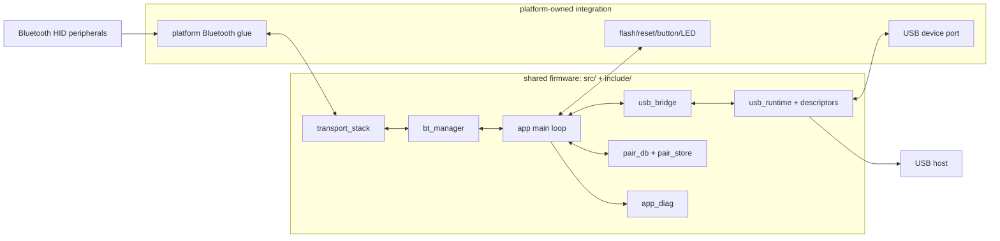

# Architecture

hidrelay-fw is bare-metal firmware for relaying Bluetooth HID peripherals to a USB host. Runtime code does not depend on a Linux kernel, userspace daemon, filesystem, device tree, or package-managed Bluetooth stack.

## Design Compromises

The firmware is built like a dedicated appliance, not a small Linux computer. That gives up familiar OS facilities, but it fits the job better: HID relay behavior needs fast boot, predictable report forwarding, controlled pairing state, and firmware-sized releases more than it needs processes, packages, or a general-purpose shell.

- Bare metal instead of Linux: we trade OS convenience for lower startup latency, less scheduler noise, smaller release artifacts, and fewer moving parts between a key press and the USB host.
- Thin platform glue instead of a broad HAL: each board owns its SDK, controller, USB, flash, and reset details under `platform/`, while app behavior stays shared and host-testable.
- Exclusive BLE and Classic pairing modes: the user flow is slightly stricter, but discovery, security, reconnect hints, and failure handling stay unambiguous.
- Dynamic USB HID topology instead of one generic interface: hosts see descriptors closer to the paired devices, at the cost of descriptor policy, remapping, and controlled USB re-enumeration.
- Small flash-backed state instead of a filesystem: pair records and reconnect hints are explicit, checksummed data, which keeps wear behavior and factory reset semantics predictable.
- Optional diagnostics instead of always-on observability: debug builds can expose telemetry and CDC diagnostics, while release builds keep that overhead and extra USB surface off.

These compromises bias the project toward reliability, repeatable releases, and clear failure boundaries. That is the right trade for firmware whose main success condition is that paired HID devices feel native to the USB host.

## System Flow

## Runtime Model

- `src/` and `include/` contain shared app, pairing, reconnect, HID report, USB bridge, diagnostics, and persistence logic.
- `platform/` contains all board, SDK, Bluetooth-controller, USB-device, flash, reset, button, LED, and flashing integration.
- The main loop polls platform inputs, advances shared app state, forwards HID reports, persists pair database changes, and emits platform actions.
- Bluetooth report ingress and USB report egress meet at shared queues, so queue policy and telemetry stay consistent across targets.
- Descriptor acceptance and report remapping happen before the USB host sees an interface, keeping host-facing behavior deterministic even when Bluetooth devices expose unusual descriptors.

## Shared Modules

- `app`: event-loop state, pairing commands, reconnect scheduling, pair database save policy, and platform outputs.
- `bt_manager`: pairing lifecycle and active Bluetooth HID session model.
- `transport_stack`: common Bluetooth HID host flow and USB-plan handoff over platform stack ports.
- `usb_bridge`: USB interface plan, bidirectional report queues, and queue telemetry.
- `usb_runtime` / `usb_descriptors`: common TinyUSB HID runtime and descriptor composition.
- `hid_report_policy` / `hid_report_remap`: descriptor acceptance, fallback selection, and report normalization.
- `pair_db` / `pair_store`: paired-device metadata, reconnect hints, schema handling, checksums, and persistent storage format.
- `app_diag`: structured diagnostics snapshots and optional CDC framing.

## Platform Boundary

Every platform implements the shared platform API for hardware primitives, persistent storage slots, Bluetooth stack bring-up, USB stack bring-up, and optional helper tooling. SDK-specific code, controller configuration, USB device porting, flash layout, board buttons, LEDs, reset behavior, and flashing scripts belong under `platform/`.

The shared code can request work such as scanning, connecting, sending reports, storing pair state, or rebooting, but it should not know which SDK call performs that work. That keeps platform churn contained and prevents board support from leaking into app or Bluetooth policy.
